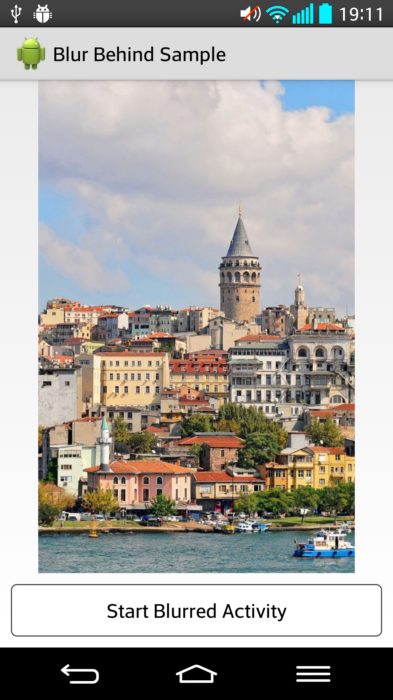
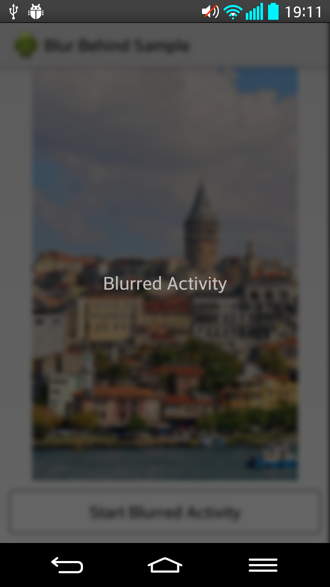
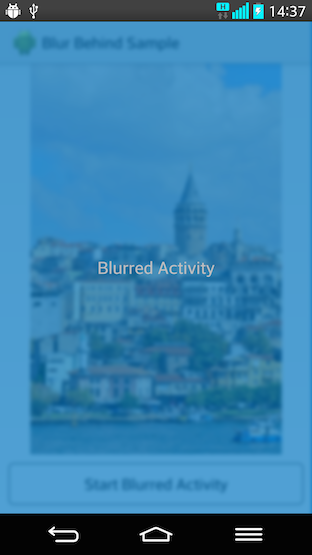

## BlurBehind

Easily have blurred and transparent background effect on your Android views.

Before API level 14 there was a `Window` flag called [`FLAG_BLUR_BEHIND`][1].
It was used for "blurring everything behind a window" and is no longer supported by Android.

BlurBehind provides an easy way to have that effect, with customization, for your window without API level restrictions.




### Usage

Invoke `BlurBehind.getInstance().execute()` method with caller `Activity` and the actual work as a `Runnable`.

```java
dummyButton.setOnClickListener(new View.OnClickListener() {
	@Override
	public void onClick(View v) {

		Runnable runnable = new Runnable() {
			@Override
			public void run() {
				Intent intent = new Intent(MainActivity.this, BlurredActivity.class);
				intent.setFlags(Intent.FLAG_ACTIVITY_NO_ANIMATION);

				startActivity(intent);
			}
		};
		BlurBehind.getInstance().execute(MainActivity.this, runnable);
	}
});
```

And use `BlurBehind.getInstance().setBackground(Activity a)` method on new `View`, which is an `Activity` in sample project:

```java
BlurBehind.getInstance().setBackground(this);
```

You can optionally set `alpha` and `filterColor`:

```java
BlurBehind.getInstance()
    .withAlpha(80)
    .withFilterColor(Color.parseColor("#0075c0")) //or Color.RED
    .setBackground(this);
```
Which will result in this:




### Dependency

- Run `gradle install` on `blur-behind` library project.

- In your `build.gradle`:
```groovy
repositories {
    mavenLocal()
}
dependencies {
    compile 'com.faradaj:blur-behind:[LATEST_RELEASE_VERSION]'
}
```

or

- In your `pom.xml`:
```xml
<dependency>
  <groupId>com.faradaj</groupId>
  <artifactId>blur-behind</artifactId>
  <version>[LATEST_RELEASE_VERSION]</version>
</dependency>
```

or you can clone and add `blur-behind` as a library project to yours.

### Credits

Mario Klingmann[2], for the original StackBlur[3] algorithm.
Yahel Bouaziz[4], for porting StackBlur to Android.
Nicolas Pomepuy[5], for his demonstration[6].


### License

    The MIT License (MIT)
    
    Copyright (c) 2014 Gokberk Ergun
    
    Permission is hereby granted, free of charge, to any person obtaining a copy
    of this software and associated documentation files (the "Software"), to deal
    in the Software without restriction, including without limitation the rights
    to use, copy, modify, merge, publish, distribute, sublicense, and/or sell
    copies of the Software, and to permit persons to whom the Software is
    furnished to do so, subject to the following conditions:
    
    The above copyright notice and this permission notice shall be included in all
    copies or substantial portions of the Software.
    
    THE SOFTWARE IS PROVIDED "AS IS", WITHOUT WARRANTY OF ANY KIND, EXPRESS OR
    IMPLIED, INCLUDING BUT NOT LIMITED TO THE WARRANTIES OF MERCHANTABILITY,
    FITNESS FOR A PARTICULAR PURPOSE AND NONINFRINGEMENT. IN NO EVENT SHALL THE
    AUTHORS OR COPYRIGHT HOLDERS BE LIABLE FOR ANY CLAIM, DAMAGES OR OTHER
    LIABILITY, WHETHER IN AN ACTION OF CONTRACT, TORT OR OTHERWISE, ARISING FROM,
    OUT OF OR IN CONNECTION WITH THE SOFTWARE OR THE USE OR OTHER DEALINGS IN THE
    SOFTWARE.
    
    
  [1]: http://developer.android.com/reference/android/view/WindowManager.LayoutParams.html#FLAG_BLUR_BEHIND
  [2]: http://www.quasimondo.com/
  [3]: http://www.quasimondo.com/StackBlurForCanvas/StackBlurDemo.html
  [4]: http://www.kayenko.com/
  [5]: https://github.com/PomepuyN
  [6]: https://github.com/PomepuyN/BlurEffectForAndroidDesign